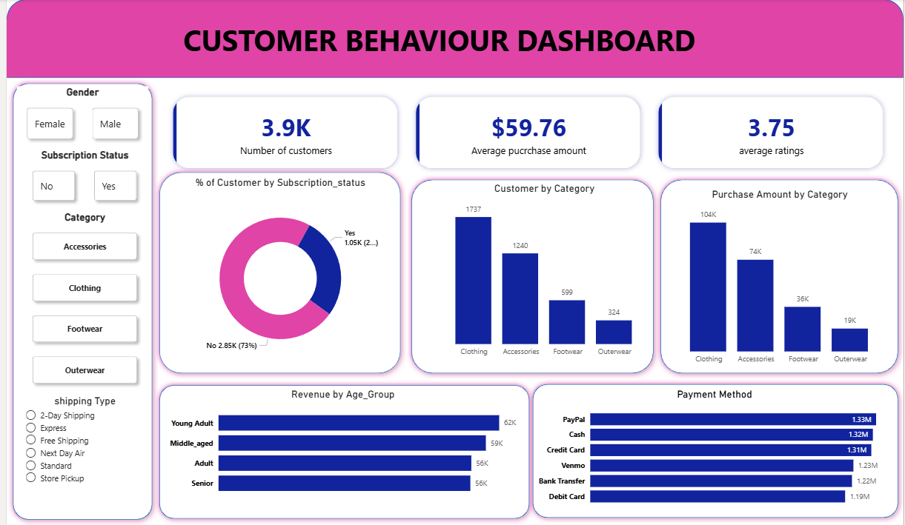

# Customer_behaviour_analysis
Customer behaviour data analytics using python, sql , power bi and powerPoint
Consumer Behaviour Analysis Project
## Project Overview

This project focuses on analyzing customer purchasing behavior to uncover insights that can help businesses understand their customers better and improve decision-making. The analysis includes data cleaning, data exploration, SQL-based analysis, and interactive dashboard visualization.
The goal of this project is to identify customer trends such as purchasing patterns, product category performance, customer demographics, and payment preferences.

## Dashboard Image
## Power BI Dashboard

## Project Workflow
## 1. Data Cleaning and Preprocessing (Python)

The raw dataset was first processed using Python to ensure data quality and usability.

## Key steps performed:

Handled missing/null values
Standardized and formatted data types
Cleaned inconsistent values
Prepared the dataset for further analysis

## Libraries used:

Pandas
NumPy

## 2. Data Analysis (SQL)

After cleaning the dataset, the processed data was transferred to a SQL database for analytical queries.

## Key analyses performed:

Customer distribution by product category.
Purchase behavior analysis.
Revenue analysis across different categories.
Customer segmentation insights.

## SQL techniques used:

Aggregations (SUM, COUNT, AVG)
Window functions
Grouping and filtering
Ranking functions

## 3. Data Visualization (Power BI)

An interactive dashboard was created to visualize customer behavior and business insights.

## Dashboard highlights:

Total number of customers
Average purchase amount
Customer ratings
Revenue by age group
Customer distribution by category
Payment method analysis
Subscription behavior insights

The dashboard helps stakeholders quickly understand patterns in customer purchasing behavior.

## 4. Presentation (PowerPoint)

A PowerPoint presentation was created to communicate the findings and insights from the analysis.
The presentation includes:

Project objective

Data analysis methodology

Key insights

Business recommendations

Dashboard overview

## Key Insights

Clothing category generated the highest revenue and customer engagement.

Young adults contributed the highest share of revenue.

Most customers were non-subscribers, indicating potential for subscription-based marketing strategies.

Digital payment methods were widely used among customers.

## Tools & Technologies

Python (Pandas, NumPy)

SQL

Power BI

PowerPoint

Project Outcome

This project demonstrates the complete data analysis workflow:
Data Cleaning → Data Analysis → Data Visualization → Business Insights

It showcases how data can be transformed into meaningful insights to support business decisions.

## Author

Nitin Agarwal
